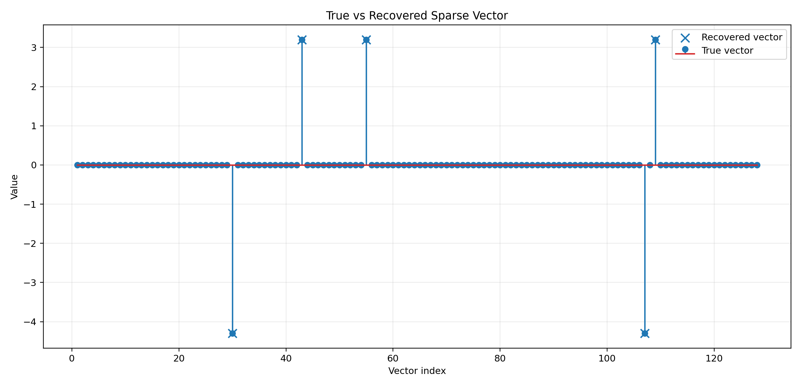
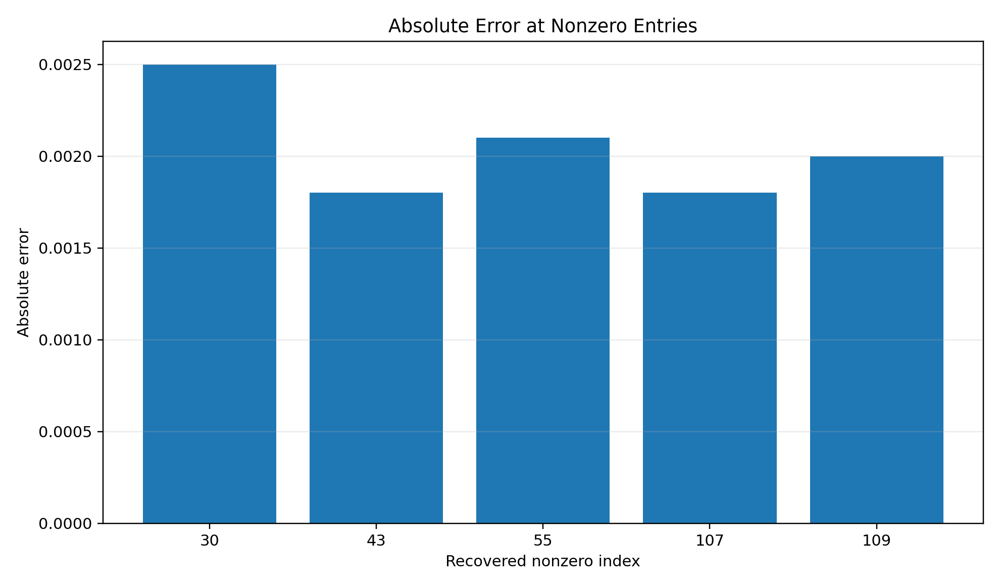

# Interior Point Method for Sparse Recovery


A MATLAB implementation of an **Interior Point Method** for recovering a sparse vector from an underdetermined linear system using **L1-norm minimization**.

The project reformulates sparse recovery as a linear programming problem, solves it with a custom Newton-style Interior Point iteration, and evaluates the recovered solution using support-recovery and numerical-error metrics.

<p align="center">
  
</p>

---

## Overview

Suppose a sparse vector $x \in \mathbb{R}^{128}$ cannot be observed directly. Instead, only 52 linear measurements are available:

$$
b = A_0x
$$

where

$$
A_0 \in \mathbb{R}^{52 \times 128}.
$$

The goal is to recover the original **5-sparse vector** from these measurements.

The recovery problem is formulated as

$$
\min_x \|x\|_1
\quad \text{subject to} \quad
A_0x = b.
$$

Because $x$ may contain both positive and negative values, decompose it as

$$
x = x^+ - x^-,
\qquad
x^+, x^- \ge 0.
$$

Define

$$
z =
\begin{bmatrix}
x^+ \\
x^-
\end{bmatrix}
$$

and

$$
A =
\begin{bmatrix}
A_0 & -A_0
\end{bmatrix}.
$$

The problem can then be written as the linear program

$$
\min_z \mathbf{1}^T z
\quad \text{subject to} \quad
Az = b.
$$

The optimization is solved with a custom Interior Point iteration. The core solver does **not** call MATLAB's `linprog`.

---

## Results

The reported run successfully recovered all five nonzero locations and closely approximated their original values.

| Metric | Result |
|---|---:|
| Signal dimension | 128 |
| Measurements | 52 |
| True nonzero entries | 5 |
| Correct support recovery | **5 / 5** |
| L2 recovery error | **0.004598** |
| Relative L2 error | **0.055880%** |
| Maximum absolute error | **0.002500** |
| Outer iterations | 20 |
| Sample runtime | 0.257777 s |

> **Note**
>
> Runtime is taken from the original MATLAB run and is machine-dependent. Error metrics are computed from the thresholded recovered vector reported by that run.

### Recovered nonzero entries

| Index | True value | Recovered value | Absolute error |
|---:|---:|---:|---:|
| 30 | -4.3000 | -4.2975 | 0.0025 |
| 43 | 3.2000 | 3.1982 | 0.0018 |
| 55 | 3.2000 | 3.1979 | 0.0021 |
| 107 | -4.3000 | -4.2982 | 0.0018 |
| 109 | 3.2000 | 3.1980 | 0.0020 |

<p align="center">
  
</p>

---

## How the Solver Works

The solver uses an outer barrier loop and an inner Newton iteration.

### 1. Update the barrier parameter

After the first outer iteration,

$$
\mu \leftarrow \rho\mu.
$$

The implementation uses

$$
\mu_0 = 10,
\qquad
\rho = 0.6.
$$

### 2. Construct the adjusted diagonal matrix

At each Newton iteration,

$$
X = \operatorname{diag}(z) + \epsilon I
$$

with

$$
\epsilon = 0.001.
$$

The diagonal adjustment acts as a numerical safeguard when forming the matrix system used by the method.

### 3. Solve for the multiplier vector

The method solves

$$
(AX^2A^T)\lambda
=
AX^2c - \mu AXe.
$$

In MATLAB, the linear system is solved with the backslash operator rather than by explicitly computing a matrix inverse.

### 4. Compute the Newton direction

The update direction is

$$
p =
Xe +
\frac{1}{\mu}
X^2(A^T\lambda - c).
$$

### 5. Update the estimate

Using a step size of

$$
\alpha = 1,
$$

the estimate is updated by

$$
z \leftarrow z + p.
$$

This corresponds to a pure Newton iteration.

### 6. Check convergence

The inner loop stops when

$$
\|p\|_2 < 10^{-9}.
$$

For a more detailed explanation, see [`docs/algorithm.md`](docs/algorithm.md).

---

## Repository Structure

```text
interior-point-sparse-recovery/
├── README.md
├── run_demo.m
│
├── src/
│   ├── build_sparse_recovery_problem.m
│   ├── interior_point_solver.m
│   └── recovery_metrics.m
│
├── results/
│   ├── recovery_comparison.png
│   ├── absolute_error.png
│   ├── recovered_nonzero_entries.csv
│   ├── reported_metrics.json
│   └── sample_output.txt
│
├── docs/
│   ├── algorithm.md
│   ├── design-decisions.md
│   └── provenance.md
│
├── NOTICE.md
└── .gitignore
```

---

## Implementation

The repository separates problem construction, optimization, evaluation, and experiment execution into independent components.

### `run_demo.m`

Main entry point for the experiment. It:

- constructs the sparse recovery problem,
- configures the solver,
- runs the Interior Point Method,
- reconstructs the signed vector,
- computes evaluation metrics,
- exports updated results and plots.

### `src/build_sparse_recovery_problem.m`

Builds the deterministic problem instance, including:

- the $52 \times 128$ measurement matrix,
- the 5-sparse ground-truth vector,
- the measurement vector $b$,
- the expanded LP matrix,
- a feasible initial estimate.

### `src/interior_point_solver.m`

Implements the custom Interior Point iteration, including:

- barrier-parameter reduction,
- matrix construction,
- multiplier-system solution,
- Newton-direction computation,
- iterative updates,
- convergence checks,
- iteration diagnostics.

### `src/recovery_metrics.m`

Computes:

- L2 recovery error,
- relative L2 error,
- maximum absolute error,
- support size,
- correct support recovery.

---

## Run Locally

### Requirements

- MATLAB
- No Optimization Toolbox is required for the custom solver

### Clone the repository

```bash
git clone https://github.com/carlotarzua/interior-point-sparse-recovery.git
cd interior-point-sparse-recovery
```

### Run the demo

From MATLAB, execute:

```matlab
run_demo
```

The script will:

1. build the deterministic sparse recovery problem,
2. execute the custom Interior Point solver,
3. reconstruct the 128-dimensional signed vector,
4. calculate recovery metrics,
5. display the recovered nonzero entries,
6. save updated results under `results/`.

Freshly generated outputs use filenames such as:

```text
latest_recovery_comparison.png
latest_absolute_error.png
latest_nonzero_entries.csv
latest_metrics.txt
```

---

## Engineering Decisions

### Modular solver design

The original single-file implementation was reorganized so that problem construction, optimization, evaluation, and experiment execution are separate.

This improves readability and makes the numerical method easier to inspect independently.

### Linear systems instead of explicit matrix inverses

The refactored initialization uses MATLAB's backslash operator:

```matlab
y = gram_matrix \ b;
x_initial = A0' * y;
```

rather than explicitly computing:

```matlab
inv(gram_matrix)
```

when the actual goal is to solve a linear system.

### Custom optimization routine

The core algorithm directly implements the Interior Point iteration instead of delegating the optimization problem to `linprog`.

### Reproducible problem instance

The measurement-matrix construction, sparse-vector locations, and sparse-vector values are deterministic.

### Explicit numerical evaluation

Support recovery and value accuracy are measured separately rather than relying only on visual inspection.

### Numerical regularization

The solver uses

$$
X = \operatorname{diag}(z) + \epsilon I
$$

with $\epsilon = 0.001$, following the specified method and reducing numerical degeneracy in the associated matrix system.

---

## Technical Concepts

This project applies concepts from:

- linear programming,
- convex optimization,
- numerical linear algebra,
- Newton methods,
- sparse signal recovery,
- constrained optimization,
- numerical error analysis,
- MATLAB scientific computing.

---

## Project Background and Attribution

This repository is based on a university **MAT 387/487** numerical optimization project.

The course materials provided the project problem, deterministic setup conventions, algorithm specification, and MATLAB scaffold surrounding the student implementation section.

The repository presents the Interior Point implementation together with subsequent work to:

- reorganize the code into modular components,
- improve numerical-programming practices,
- add quantitative recovery metrics,
- generate result visualizations,
- document the algorithm and engineering decisions.

For additional details, see:

- [`docs/provenance.md`](docs/provenance.md)
- [`NOTICE.md`](NOTICE.md)

---

## Author

**Carlota Arzúa Alonso**  
Mathematics and Computer Science  
DePaul University

[GitHub Profile](https://github.com/carlotarzua)
